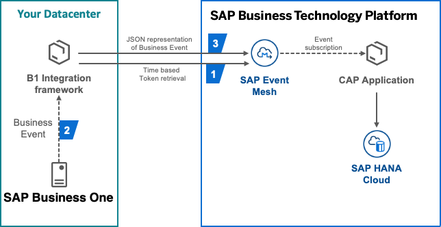
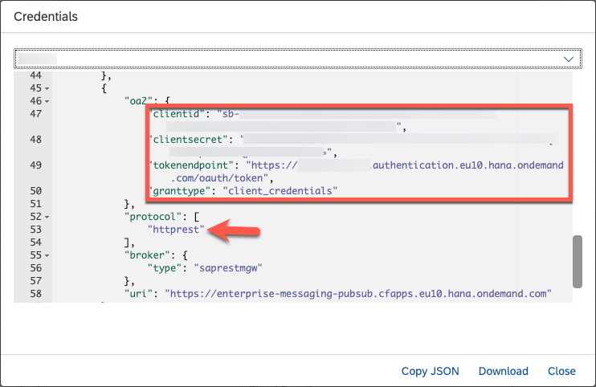
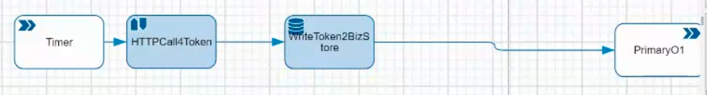
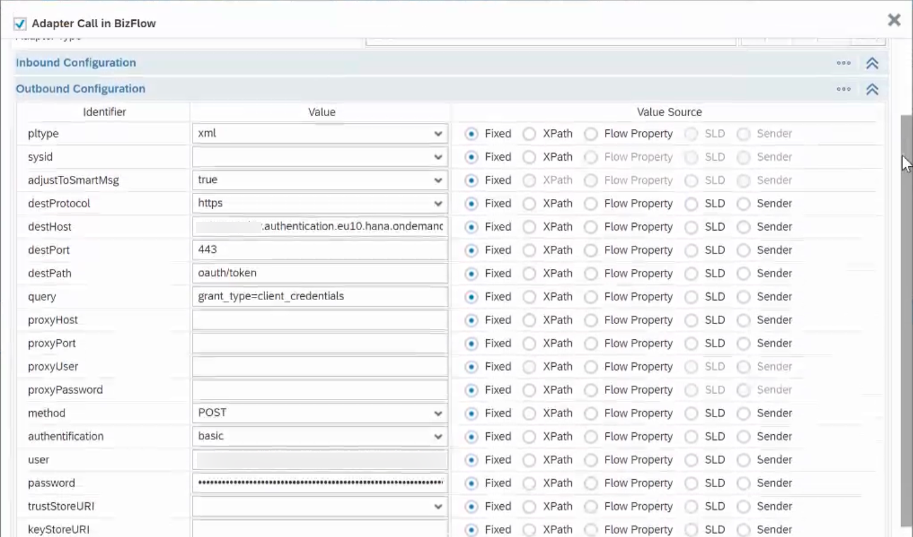
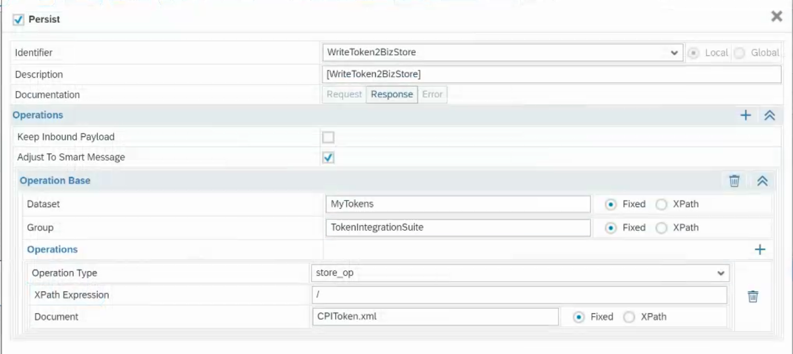
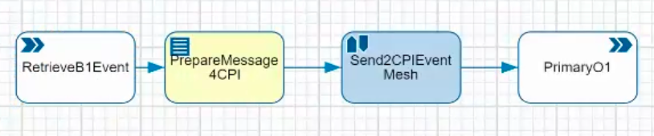
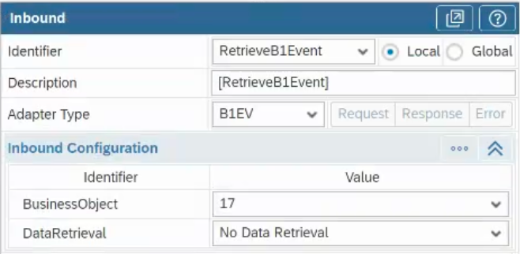
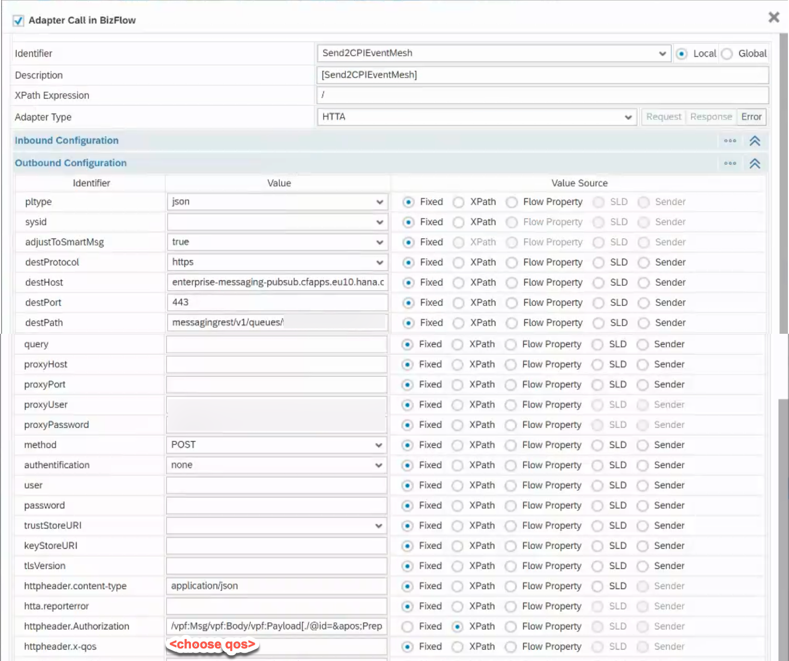
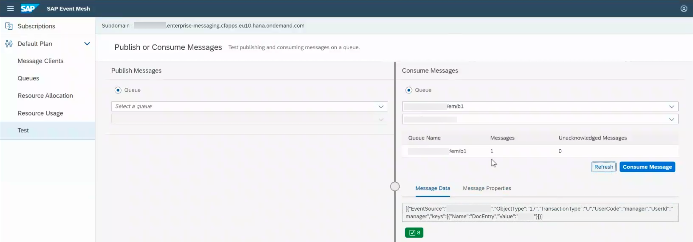

One of the (sometimes) hidden champions in the SAP product universe is SAP Business One (B1) – an ERP solution for SME customers that has been around for almost 20 years now. The age doesn’t make it irrelevant though as there still is a strong customer base happily working on B1 as is the case for one of my recent customers: Actovent and their flagship solution “[Frischluftmanager](https://www.linkedin.com/posts/glenn-gonzalez_customerspotlight-sustainability-innovation-activity-6887306052489027584-dVIM)“. The solution was developed on the SAP Business Technology Platform (BTP) accessing the B1 Service Layer and therefore being dependent on it. To alleviate the dependency and reduce load on the B1 system, the decision was made, to the decouple the extension from the B1 system. The main challenge was to keep up to date with relevant data such as Business Partner data as well as Order Data. Therefore an event-driven architecture was established to integrate the solution with the B1 system.

The benefits of the solution are:

- Reduced load on the B1 system (push instead of pull)
- Near-real-time current master / customer data in BTP
- Easy to extend on further use cases (additional events)
- [All the other advantages of an event-driven architecture](https://blogs.sap.com/2022/09/01/saps-event-driven-ecosystem-revisited/)

The [Business One Integration framework](https://blogs.sap.com/2018/08/14/integration-framework-for-sap-business-one-b1if-central-blog/) (B1If) is the key integration channel for B1 and our use case. The integration framework provides an infrastructure that allows for the communication and interaction between software applications such as SAP Business One, other SAP solutions as well as non-SAP systems; whether they are cloud applications or on-premise applications. In this case we’ll use it to connect our B1 system to the SAP Event Mesh service on SAP BTP.

## Getting Started

The BOM of the solution is pretty short:

- A running SAP Business One system with the B1 Integration framework (B1If) set up
- [SAP Event Mesh](https://help.sap.com/docs/SAP_EM?locale=en-US) instance on BTP
- An application actually handling the events in BTP

To get an overview of the envisioned solution here’s the architecture diagram with all components including a sample application handling the events by storing their contents in SAP HANA Cloud:


<p class="image_caption" style="text-align: center; font-style: italic;">Architecture Overview</p>

## Token Retrieval Scenario

The first scenario to be developed is an auxiliary scenario which we need to be able to authenticate for our later publication of the events to the SAP Event Mesh instance. For this we need the credentials of the SAP Event Mesh instance from the BTP cockpit which requires [a service key to be created](https://help.sap.com/docs/BTP/65de2977205c403bbc107264b8eccf4b/4514a14ab6424d9f84f1b8650df609ce.html) for this instance. When copying the credentials it is important to choose the credentials where the protocol is `httprest`.


<p class="image_caption" style="text-align: center; font-style: italic;">SAP Event Mesh instance credentials</p>

The retrieval scenario in B1If is rather simple as it only consists of a time based trigger, an HTTP outbound call and storing the retrieved token in the BizStore. The flow is depicted in below pictures along with the details needed both for the token retrieval as well as storing it in the BizStore of the B1If instance. Since the OAuth token returned by the Event Mesh service expires after 11:59:59 h it’s advisable to set the recurrence to an amount shorter than that to always have a current token.


<p class="image_caption" style="text-align: center; font-style: italic;">Token retrieval scenario flow</p>


<p class="image_caption" style="text-align: center; font-style: italic;">HTTP call for token</p>


<p class="image_caption" style="text-align: center; font-style: italic;">Write token to BizStore</p>

## Event Forwarding Scenario
The actual event forwarding scenario is triggered by events raised from the SAP Business One system. We then generate the message to be sent to the SAP Event Mesh instance from the Business Event, convert it to JSON and add in the previously retrieved OAuth token for authentication. The resulting JSON is then sent out to the SAP Event Mesh instance into a queue specified in the outbound HTTP call. In the Business Event trigger we can choose whether the data itself should be retrieved as well depending on our use case. In this case the retrieval is not done to keep the flow a bit more simple for this blog.


<p class="image_caption" style="text-align: center; font-style: italic;">Event forwarding scenario flow</p>


<p class="image_caption" style="text-align: center; font-style: italic;">Event trigger: BusinessObject Order (17)</p>

In our use case the desired format in BTP is JSON which means a conversion from XML to JSON is needed. To give you a reference point, an example extract of the event’s XML that is passed by the B1 event trigger can be seen below.

```xml
<Event>
    <b1e:b1events>
        <b1e:b1event>
            <b1e:eventsource>XXXXXXXXXX</b1e:eventsource>
            <b1e:objecttype>17</b1e:objecttype>
            <b1e:transactiontype>U</b1e:transactiontype>
            <b1e:usercode>manager</b1e:usercode>
            <b1e:userid>manager</b1e:userid>
            <b1e:keys count="1">
                <b1e:key>
                    <b1e:name>DocEntry</b1e:name>
                    <b1e:value>4711</b1e:value>
                </b1e:key>
            </b1e:keys>
        </b1e:b1event>
    </b1e:b1events>
</Event>
```

The creation of the desired JSON version of the message is achieved through an `xsl` template file which can be seen below. It retrieves the previously fetched OAuth token and populates it into a variable to be used in the HTTP call. The message body itself is transformed into a JSON array of events published by the B1 system with the relevant details from each of the events.

```xml
<?xml version="1.0" encoding="UTF-8"?>
<xsl:stylesheet xmlns:b1e="urn:com.sap.b1i.sim:b1event" xmlns:b1ie="urn:com.sap.b1i.sim:b1ievent" xmlns:b1im="urn:com.sap.b1i.sim:b1imessage" xmlns:bfa="urn:com.sap.b1i.bizprocessor:bizatoms" xmlns:exslt="http://exslt.org/common" xmlns:jdbc="urn:com.sap.b1i.adapter:jdbcadapter" xmlns:js="com.sap.b1i.bpc_tools.Javascript" xmlns:rev="urn:com.sap.b1i.adapter:revaadapter" xmlns:rfc="urn:sap-com:document:sap:rfc:functions" xmlns:sim="urn:com.sap.b1i.sim:entity" xmlns:utils="com.sap.b1i.bpc_tools.Utilities" xmlns:vpf="urn:com.sap.b1i.vplatform:entity" xmlns:xca="urn:com.sap.b1i.xcellerator:appconfig" xmlns:xci="urn:com.sap.b1i.xcellerator:intdoc" xmlns:xsl="http://www.w3.org/1999/XSL/Transform" version="1.0" exclude-result-prefixes="b1e b1ie b1im bfa jdbc js rfc utils xci xca vpf exslt sim rev" b1e:force="" b1ie:force="" b1im:force="" bfa:force="" jdbc:force="" js:force="" rfc:force="" utils:force="" xci:force="" xca:force="" vpf:force="" exslt:force="" sim:force="" rev:force="">
    <?prodver 1.0.0?>
    <xsl:include href="../../com.sap.b1i.dev.repository/IDE/init.xsl"></xsl:include>
    <xsl:variable name="msg" select="/vpf:Msg/vpf:Body/vpf:Payload[./@Role=&apos;S&apos;]"></xsl:variable>
    <xsl:template match="/">
        <vpf:Msg>
            <xsl:copy-of select="/vpf:Msg/@*"></xsl:copy-of>
            <xsl:copy-of select="/vpf:Msg/vpf:Header"></xsl:copy-of>
            <vpf:Body>
                <xsl:copy-of select="/vpf:Msg/vpf:Body/*"></xsl:copy-of>
                <vpf:Payload Role="X" id="{$atom}">
                    <xsl:call-template name="transform"></xsl:call-template>
                </vpf:Payload>
            </vpf:Body>
        </vpf:Msg>
    </xsl:template>
    <xsl:template name="transform">
        <xsl:variable name="token">
            <xsl:value-of select="document(&apos;/MyTokens/TokenIntegrationSuite/CPIToken.xml&apos;)//bfa:string[@name=&apos;access_token&apos;]"></xsl:value-of>
        </xsl:variable>
        <ReadToken>
            <xsl:value-of select="concat(&apos;Bearer&apos;, &apos; &apos;, $token)"></xsl:value-of>
        </ReadToken>
        <io xmlns="urn:com.sap.b1i.bizprocessor:bizatoms" pltype="json">
            <array name="b1events">
                <xsl:for-each select="/Event/b1e:b1events/b1e:b1event">
                    <object>
                        <string name="EventSource">
                            <xsl:value-of select="./b1e:eventsource"></xsl:value-of>
                        </string>
                        <string name="ObjectType">
                            <xsl:value-of select="./b1e:objecttype"></xsl:value-of>
                        </string>
                        <string name="TransactionType">
                            <xsl:value-of select="./b1e:transactiontype"></xsl:value-of>
                        </string>
                        <string name="UserCode">
                            <xsl:value-of select="./b1e:usercode"></xsl:value-of>
                        </string>
                        <string name="UserId">
                            <xsl:value-of select="./b1e:userid"></xsl:value-of>
                        </string>
                        <array name="keys">
                            <xsl:for-each select="./b1e:keys/b1e:key">
                                <object>
                                    <string name="Name">
                                        <xsl:value-of select="./b1e:name"></xsl:value-of>
                                    </string>
                                    <string name="Value">
                                        <xsl:value-of select="./b1e:value"></xsl:value-of>
                                    </string>
                                </object>
                            </xsl:for-each>
                        </array>
                    </object>
                </xsl:for-each>
            </array>
        </io>
    </xsl:template>
</xsl:stylesheet>
```

After the message has been prepared for sending, the HTTP call takes care of delivering the message to the SAP Event Mesh instance. For this step some additional HTTP headers are needed:

- `Authorization`: Contains the OAuth token
- `x-qos`:  Quality of service desired for this message
- `content-type`: Content type to ensure correct processing in the consuming application

Additionally, the `pltype` configuration is set as json to ensure the correct output format. In the `destPath` configuration the queue name is populated to identify the queue the message is meant for. The queue name should be URl encoded as stated in the [SAP Event Mesh API documentation](https://api.sap.com/api/SAPEventMeshDefaultMessagingAPIs/resource). The value of the `Authorization` header is populated through the following XPath expression accessing the attribute holding the token in the message:

`/vpf:Msg/vpf:Body/vpf:Payload[./@id=&apos;PrepareMessage4CPI&apos;]/ReadToken`


<p class="image_caption" style="text-align: center; font-style: italic;">HTTP call to SAP Event Mesh</p>

## Result in SAP Event Mesh

The resulting message in SAP Event Mesh can be viewed in the SAP Event Mesh application accessible through the BTP cockpit. After going to the Test section of the UI and selecting the queue previously defined in the destination path (and of course triggering the scenario by creating an order in your B1 system) you should see that there is a new message looking something like this:


<p class="image_caption" style="text-align: center; font-style: italic;">SAP Event Mesh test console</p>

## Summary

Now that you have your Business Event in the SAP Event Mesh you can go ahead and build extension scenarios with that information, add more scenarios in the B1If for other events or change the information transmitted with the event. This setup enables you to develop decoupled business extensions in SAP Business Technology Platform with all the tools and services provided by SAP BTP in whichever language suits you or your use case best.

If you’re interested in more use cases that could benefit from such a decoupled setup I recommend you to head over to the quite similar blog on [connecting SAP ByDesign to SAP Event Mesh](https://blogs.sap.com/2020/10/09/how-to-get-sap-business-bydesign-events-in-a-loosely-coupled-solution/) by [Maria Trinidad MARTINEZ GEA](https://people.sap.com/mariatrinidad.martinezgea).

I’d like to thank my customer Actovent and their partner Agilita for the opportunity to get this to work as a team effort as well as my colleague [Nicolas Fuchs](https://people.sap.com/nicolas.fuchs) for his help on the B1If side!